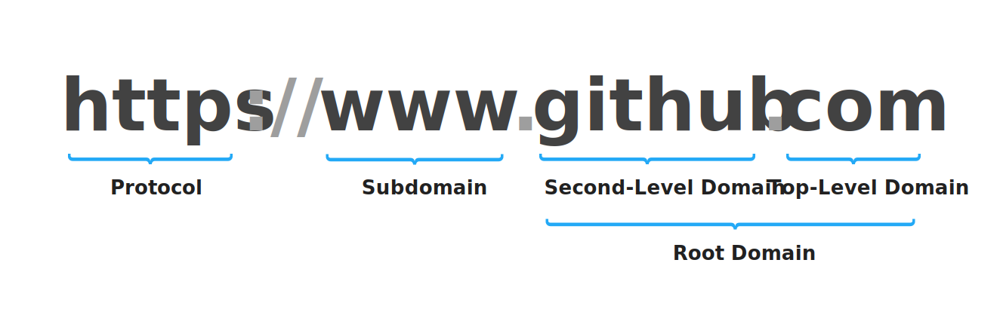

[](https://github.com/gumob/TLDExtractSwift)
[](http://cocoadocs.org/docsets/TLDExtract)
[](http://cocoadocs.org/docsets/TLDExtract)
[](https://travis-ci.com/gumob/TLDExtractSwift)
[](https://codecov.io/gh/gumob/TLDExtractSwift)


# TLDExtractSwift
<code>TLDExtract</code> is a pure Swift library to allows you to get the public suffix of a domain name using [the Public Suffix List](http://www.publicsuffix.org).<br/>

## What are domains?

Domain names are the unique, human-readable Internet addresses of websites. They are made up of three parts: a top-level domain (a.k.a. TLD), a second-level domain name, and an optional subdomain.



## Requirements

- iOS 9.3 or later
- macOS 10.12 or later
- tvOS 12.0 or later
- Swift 4.2
- Python 2.7 or Python 3

<small>* No plans to support tvOS 11 or earlier for now</small>


## Installation

### Carthage

Add the following to your `Cartfile` and follow [these instructions](https://github.com/Carthage/Carthage#adding-frameworks-to-an-application).

```
github "gumob/TLDExtractSwift"
```

### CocoaPods

To integrate TLDExtract into your project, add the following to your `Podfile`.

```ruby
platform :ios, '9.3'
use_frameworks!

pod 'TLDExtractSwift'
```
## Usage

### Initialization

Basic initialization code. Exceptions will not be raised unless [the Public Suffix List on the server](https://publicsuffix.org/list/public_suffix_list.dat) is broken.
```swift
import TLDExtract

let extractor = try! TLDExtract()
```

A safer initialization code to avoid errors by using the frozen Public Suffix List:
The Public Suffix List is updated every time the framework is built. By setting userFrozenData to true, TLDExtract load data checked out from the repository.
```swift
import TLDExtract

let extractor = try! TLDExtract(useFrozenData: true)
```

### Extraction

#### Passing argument as String

Extract an url:

```swift
guard let result: TLDResult = extractor.parse("https://www.github.com/gumob/TLDExtract") else { return }

print(result.rootDomain)        // Optional("github.com")
print(result.topLevelDomain)    // Optional("com")
print(result.secondLevelDomain) // Optional("github")
print(result.subDomain)         // Optional("www")
```

Extract a hostname:

```swift
guard let result: TLDResult = extractor.parse("gumob.com") else { return }

print(result.rootDomain)        // Optional("gumob.com")
print(result.topLevelDomain)    // Optional("com")
print(result.secondLevelDomain) // Optional("gumob")
print(result.subDomain)         // nil
```

Extract an unicode hostname:

```swift
guard let result: TLDResult = extractor.parse("www.ラーメン.寿司.co.jp") else { return }

print(result.rootDomain)        // Optional("寿司.co.jp")
print(result.topLevelDomain)    // Optional("co.jp")
print(result.secondLevelDomain) // Optional("寿司")
print(result.subDomain)         // Optional("www.ラーメン")
```

Extract a punycoded hostname (Same as above):

```swift
guard let result: TLDResult = extractor.parse("www.xn--4dkp5a8a.xn--sprr0q.co.jp") else { return }

print(result.rootDomain)        // Optional("xn--sprr0q.co.jp")
print(result.topLevelDomain)    // Optional("co.jp")
print(result.secondLevelDomain) // Optional("xn--sprr0q")
print(result.subDomain)         // Optional("www.xn--4dkp5a8a")
```

#### Passing argument as Foundation URL

Extract an unicode url: <br/>
URL class in Foundation Framework does not support unicode URLs by default. You can use URL extension as a workaround
```swift
guard let result: TLDResult = extractor.parse(URL(unicodeString: "http://www.ラーメン.寿司.co.jp")) else { return }

print(result.rootDomain)        // Optional("xn--sprr0q.co.jp")
print(result.topLevelDomain)    // Optional("co.jp")
print(result.secondLevelDomain) // Optional("xn--sprr0q")
print(result.subDomain)         // Optional("www.xn--4dkp5a8a")
```

Encode an url by passing argument as percent encoded string:
```swift
let urlString: String = "http://www.ラーメン.寿司.co.jp".addingPercentEncoding(withAllowedCharacters: .urlQueryAllowed)!
print(urlString)                // http://www.%E3%83%A9%E3%83%BC%E3%83%A1%E3%83%B3.%E5%AF%BF%E5%8F%B8.co.jp

guard let result: TLDResult = extractor.parse(URL(string: urlString)) else { return }

print(result.rootDomain)        // Optional("www.ラーメン.寿司.co.jp")
print(result.topLevelDomain)    // Optional("co.jp")
print(result.secondLevelDomain) // Optional("寿司")
print(result.subDomain)         // Optional("www.ラーメン")
```

Encode an unicode url by using [`Punycode`](https://github.com/gumob/Punycode) Framework:

```swift
import Punycode

let urlString: String = "http://www.ラーメン.寿司.co.jp".idnaEncoded!
print(urlString)                // http://www.xn--4dkp5a8a.xn--sprr0q.co.jp

guard let result: TLDResult = extractor.parse(URL(string: urlString)) else { return }

print(result.rootDomain)        // Optional("xn--sprr0q.co.jp")
print(result.topLevelDomain)    // Optional("co.jp")
print(result.secondLevelDomain) // Optional("xn--sprr0q")
print(result.subDomain)         // Optional("www.xn--4dkp5a8a")
```


## Copyright

TLDExtract is released under MIT license, which means you can modify it, redistribute it or use it however you like.
